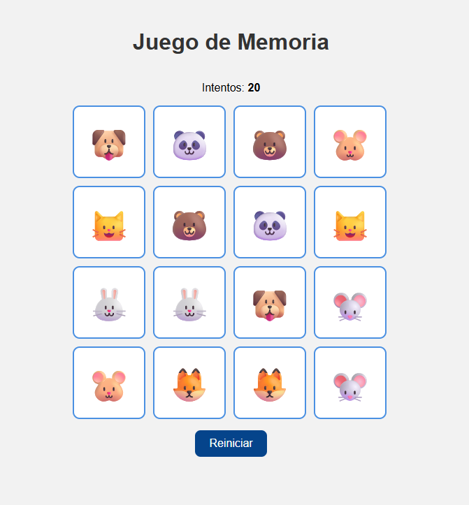
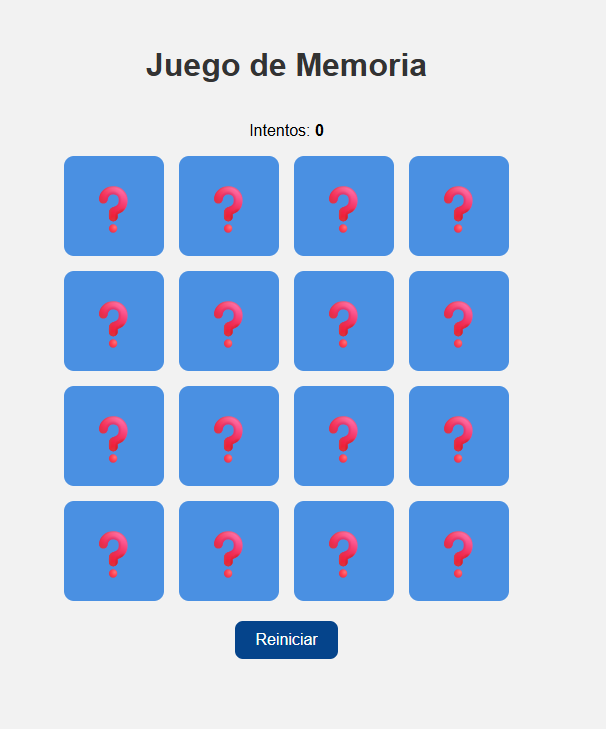

# 🧠 Juego de Memoria

Un sencillo **juego de memoria con emojis** desarrollado en **HTML, CSS y JavaScript**, ideal para practicar manipulación del DOM, eventos y lógica de programación en JavaScript.

---

## 🎯 Objetivo del juego

Encuentra todos los pares de cartas con el menor número de intentos posible.  
Cada carta tiene un emoji oculto que se revela al hacer clic.  
Cuando las dos cartas coinciden, permanecen descubiertas.

---

## 🧱 Estructura del proyecto

```
📁 juego-memoria/
├── memoria.html      # Estructura principal del juego
├── style.css         # Estilos visuales y animaciones
└── script.js         # Lógica del juego (mezcla, volteo y reinicio)
```

---

## 🚀 Cómo ejecutar el proyecto

1. Descarga o clona este repositorio:
   ```bash
   git clone https://github.com/mvgarc/juego-memoria.git
   ```
2. Abre el archivo **`memoria.html`** en tu navegador.
3. ¡Comienza a jugar y prueba tu memoria! 🧩

---

## 🧠 Funcionalidades principales

- Volteo de cartas con animación 3D.  
- Contador de intentos actualizado en tiempo real.  
- Botón de reinicio sin necesidad de recargar la página.  
- Diseño adaptable con emojis grandes y centrados.


## 💡 Ideal para estudiantes

Este proyecto es excelente para **practicar conceptos básicos e intermedios de JavaScript**, como:
- Manipulación del DOM.
- Eventos (`click`).
- Uso de arrays y funciones.
- Control de estado del juego (cartas volteadas, coincidencias, movimientos).


## 🧩 Captura de ejemplo






## 👩‍💻 Autor

Proyecto desarrollado con fines educativos por **María García**.  
Puedes modificarlo libremente para tus clases o prácticas personales.
